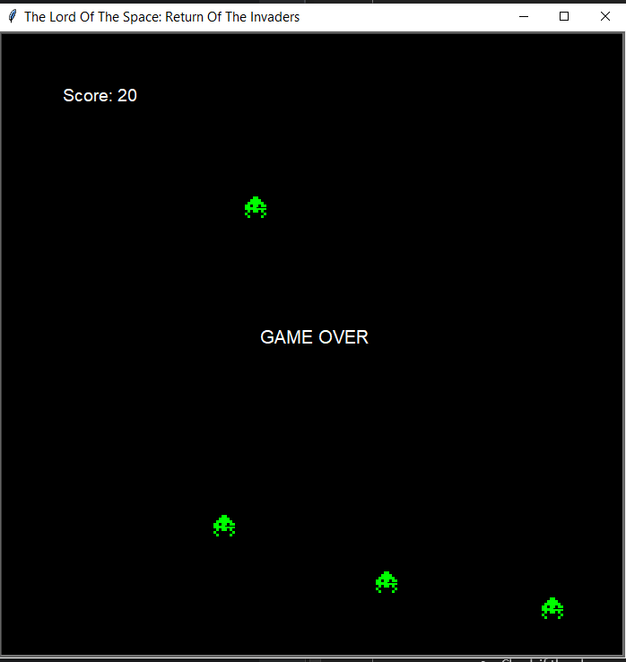

# The Lord Of The Space: Return Of The Invaders

A simple Space Invader game implemented in Python using the Turtle module.

## How to Play

1. Clone the repository.
2. Run the main Python file (`main.py`) to start the game.
3. Use the arrow keys to control the player spaceship: Left, Right.
4. use space to Shoot: Space

## Gameplay

